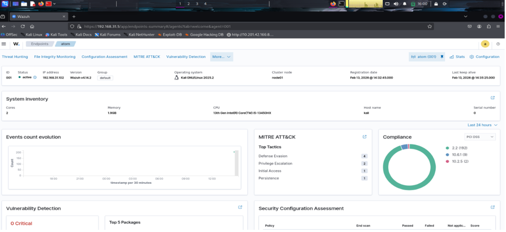
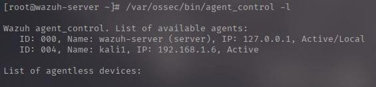
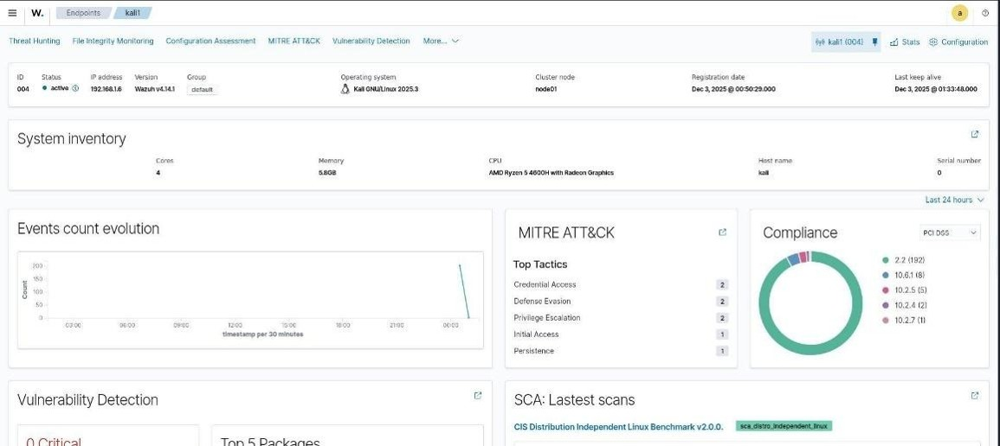
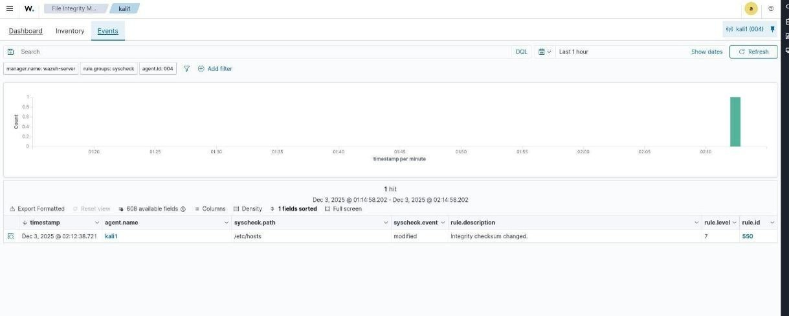
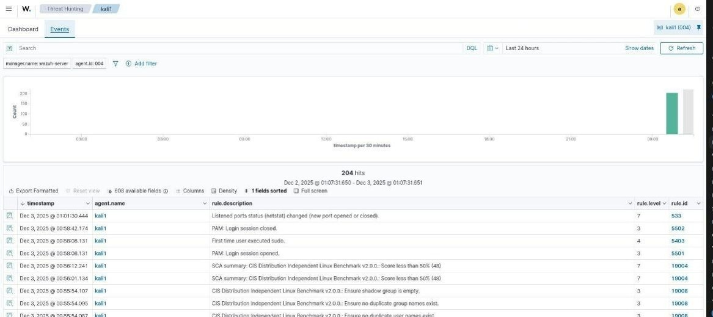
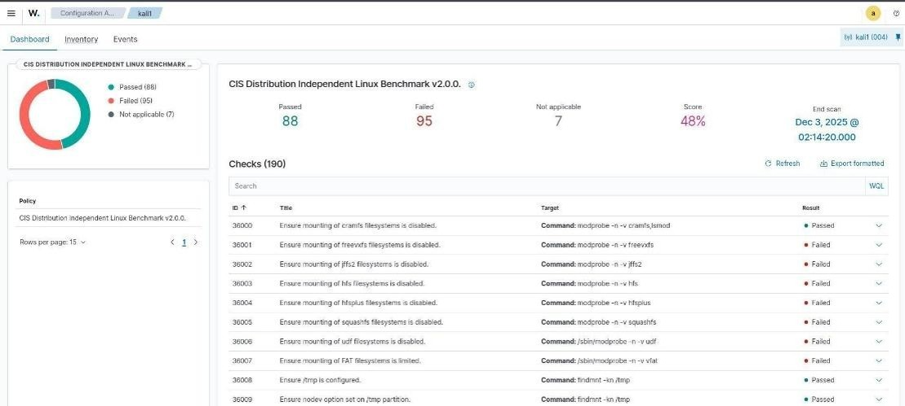

# Wazuh SIEM Implementation

## Overview

This project demonstrates the complete implementation of the **Wazuh Open Source SIEM (Security Information and Event Management)** platform. The project includes the installation and configuration of the Wazuh Manager, Indexer, Dashboard, deployment of a Wazuh Agent on Kali Linux, and validation of security monitoring features such as File Integrity Monitoring (FIM), Threat Detection, and Security Configuration Assessment (SCA).

---

## Project Objectives

- Install and configure the Wazuh SIEM platform.
- Deploy and register a Wazuh Agent on Kali Linux.
- Monitor endpoint activities in real time.
- Generate File Integrity Monitoring (FIM) events.
- Detect security events and suspicious activities.
- Perform Security Configuration Assessment (SCA).
- Demonstrate centralized security monitoring.

---

## Environment

| Component | Version |
|-----------|---------|
| Wazuh | 4.14.1 |
| Wazuh Dashboard | 4.14.1 |
| Wazuh Manager | 4.14.1 |
| Wazuh Indexer | 4.14.1 |
| Agent OS | Kali Linux 2025.3 |
| Server OS | Ubuntu/Debian |

---

## Project Architecture

```
+------------------+
| Kali Linux Agent |
+------------------+
         |
         | Secure Communication (Port 1514)
         |
+------------------+
|  Wazuh Manager   |
+------------------+
         |
         |
+------------------+
| Wazuh Indexer    |
+------------------+
         |
         |
+------------------+
| Wazuh Dashboard  |
+------------------+
```

---

## Features Implemented

- Wazuh Manager Installation
- Wazuh Dashboard Configuration
- Wazuh Indexer Setup
- Kali Linux Agent Deployment
- Agent Registration
- File Integrity Monitoring (FIM)
- Threat Hunting
- Security Event Detection
- Security Configuration Assessment (SCA)
- Dashboard Monitoring

---

## Screenshots

### Dashboard Overview



---

### Agent Status



---

### File Integrity Monitoring



---

### Threat Hunting Events



---

### Security Configuration Assessment



---

### Alerts Dashboard



---

## Skills Demonstrated

- SIEM Implementation
- Linux Administration
- Endpoint Monitoring
- Security Event Monitoring
- Threat Detection
- Log Analysis
- File Integrity Monitoring
- Security Configuration Assessment
- Incident Detection
- Blue Team Operations

---

## Tools Used

- Wazuh
- Ubuntu Linux
- Kali Linux
- Linux Terminal
- GitHub

---

## Learning Outcomes

Through this project I gained hands-on experience in:

- Installing and configuring a SIEM solution.
- Monitoring Linux endpoints.
- Detecting security events.
- Investigating alerts using the Wazuh Dashboard.
- Performing security configuration assessments.
- Understanding centralized log management.

---

## Project Report

The detailed project report is included in this repository:

**WAZUH_REPORT_KARTHIKEYAN.pdf**

---

## Author

**Karthikeyan M**

Cybersecurity Student

GitHub: https://github.com/karthikmanoj458-oss

---

## License

This project is created for educational and learning purposes.
